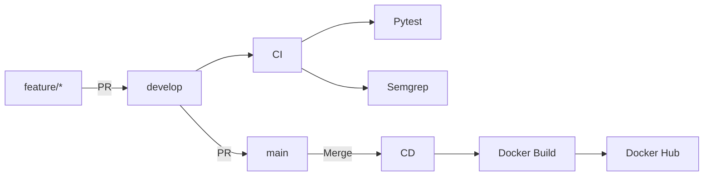

# CloudOps API | CI/CD com GitHub Actions

API REST desenvolvida em Python com FastAPI para implementação de uma pipeline completa de **CI/CD utilizando GitHub Actions**.

O projeto automatiza testes unitários, análise estática de segurança, build de imagem Docker e publicação no Docker Hub, seguindo um fluxo de branches baseado em GitFlow.

## Tecnologias

- Python 3.11
- FastAPI
- Pytest
- Semgrep
- Docker
- Docker Hub
- GitHub Actions
- Git

## Endpoints

### `GET /`

Retorna informações da aplicação:

```json
{
  "mensagem": "Hello World - CloudOps Pipeline!",
  "status": "online",
  "versao": "1.0.0"
}
```

### `GET /health`

Retorna o status da aplicação:

```json
{
  "status": "healthy"
}
```

## Executando localmente

Instale as dependências:

```bash
pip install -r requirements.txt
```

Inicie a aplicação:

```bash
uvicorn app.main:app --host 0.0.0.0 --port 8000
```

A API ficará disponível em:

```text
http://localhost:8000
```

## Testes

Execute os testes unitários com:

```bash
pytest tests/ -v
```

Os testes validam o status code e o conteúdo retornado pelos endpoints.

## Docker

Construir a imagem:

```bash
docker build -t pipeline-desafio1:test .
```

Executar o container:

```bash
docker run --rm -p 8000:8000 pipeline-desafio1:test
```

## Pipeline CI/CD



### CI

O workflow de CI é executado em Pull Requests para `develop` e `main`.

Ele realiza:

- execução dos testes com Pytest;
- análise estática de segurança com Semgrep.

### CD

Após o merge para `main`, o workflow de CD:

- realiza o build da imagem Docker;
- autentica no Docker Hub utilizando GitHub Secrets;
- publica a imagem com as tags `latest` e SHA do commit.

## GitFlow

O projeto utiliza as seguintes branches:

- `main` — código de produção;
- `develop` — integração de funcionalidades;
- `feature/*` — desenvolvimento de funcionalidades.

Fluxo:

```text
feature/* → develop → main
```

As integrações são realizadas através de Pull Requests.

## Segurança

As credenciais do Docker Hub são armazenadas como GitHub Secrets:

```text
DOCKERHUB_USERNAME
DOCKERHUB_TOKEN
```

Nenhuma credencial é armazenada diretamente no código.

## Docker Hub

A imagem da aplicação é publicada em:

```text
dorim1502/pipeline-desafio1
```